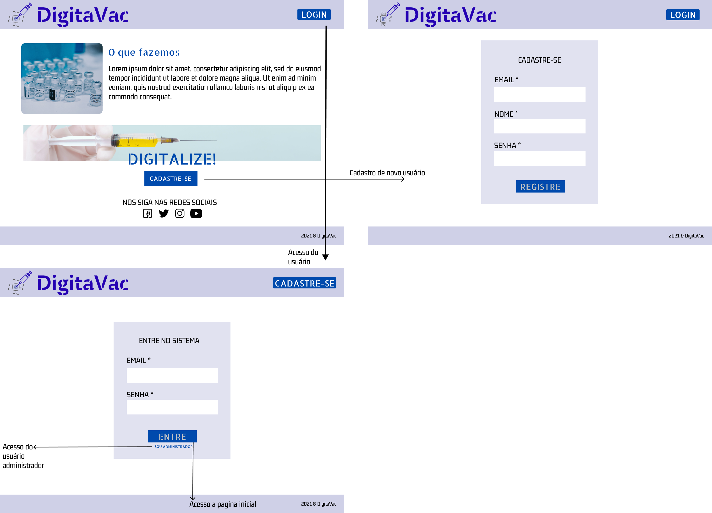
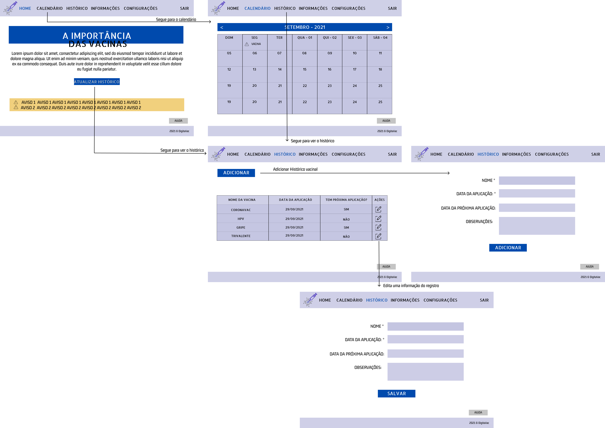
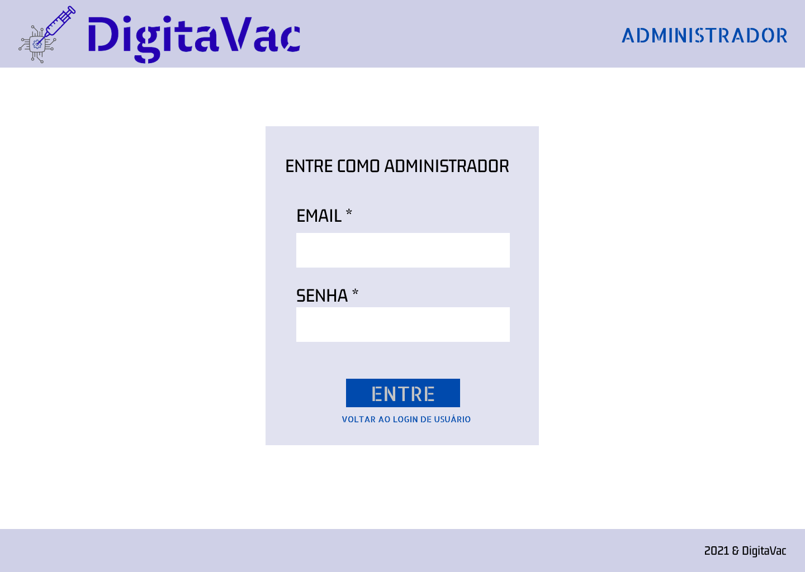
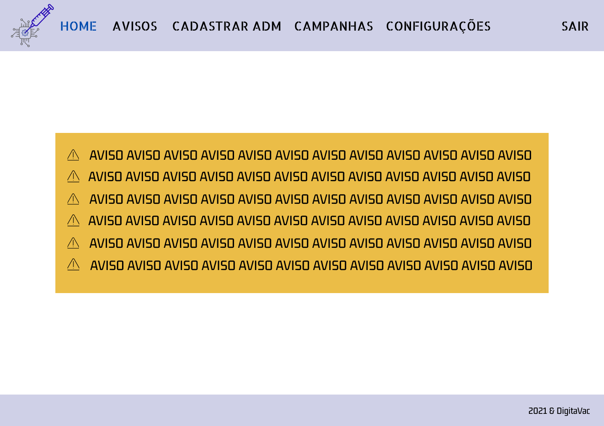
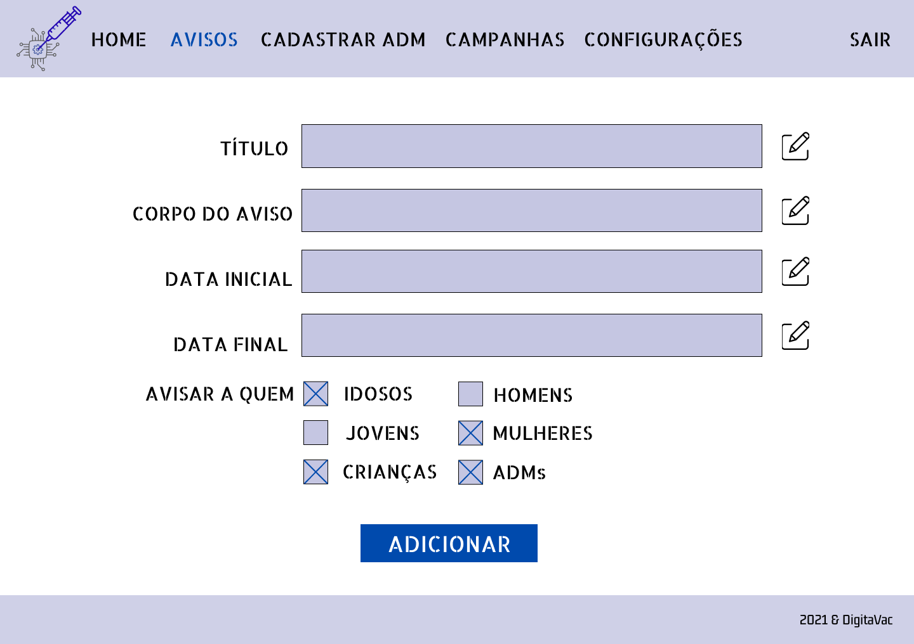
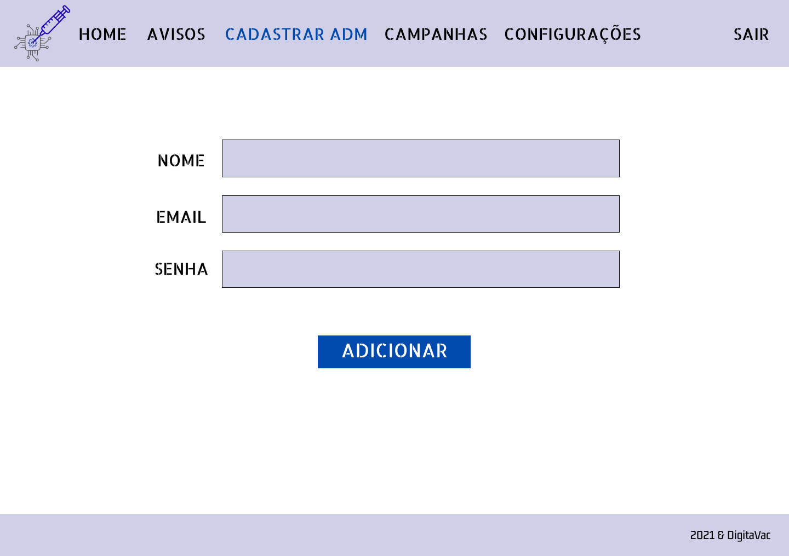
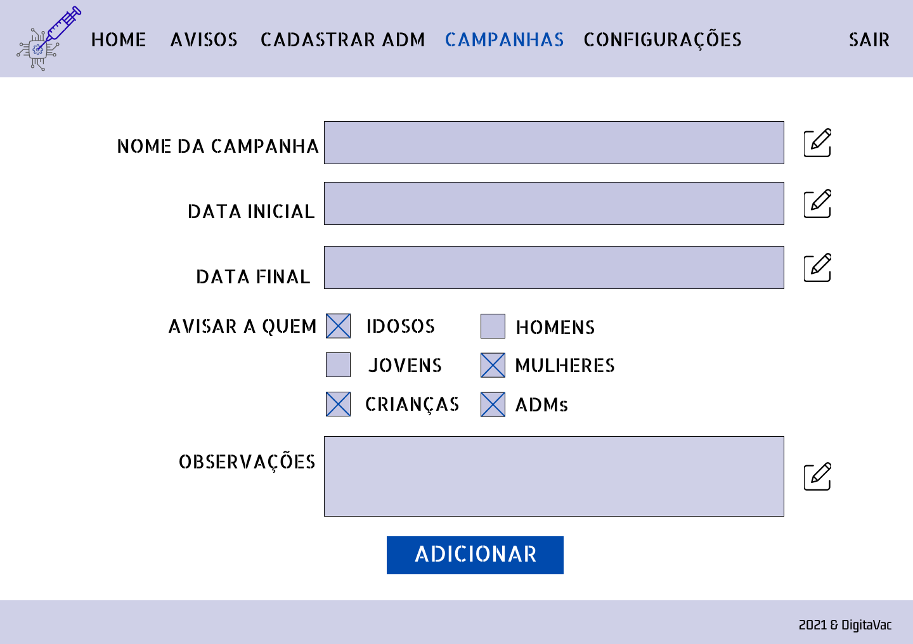
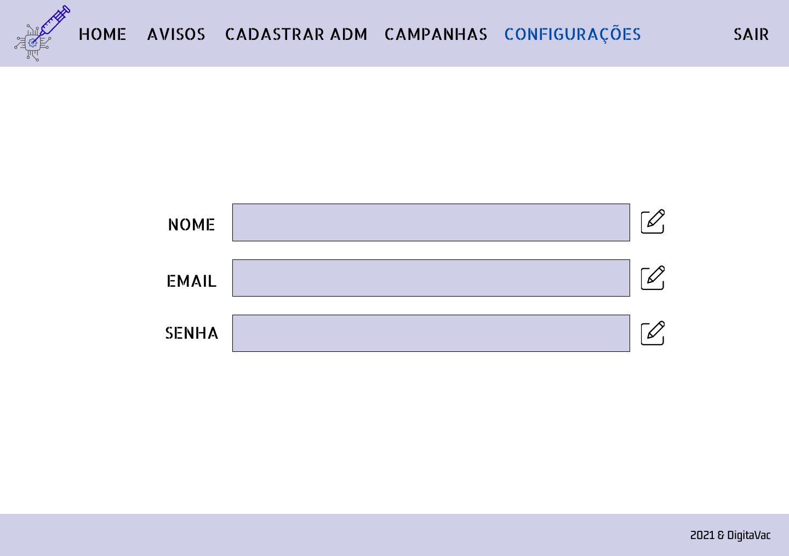
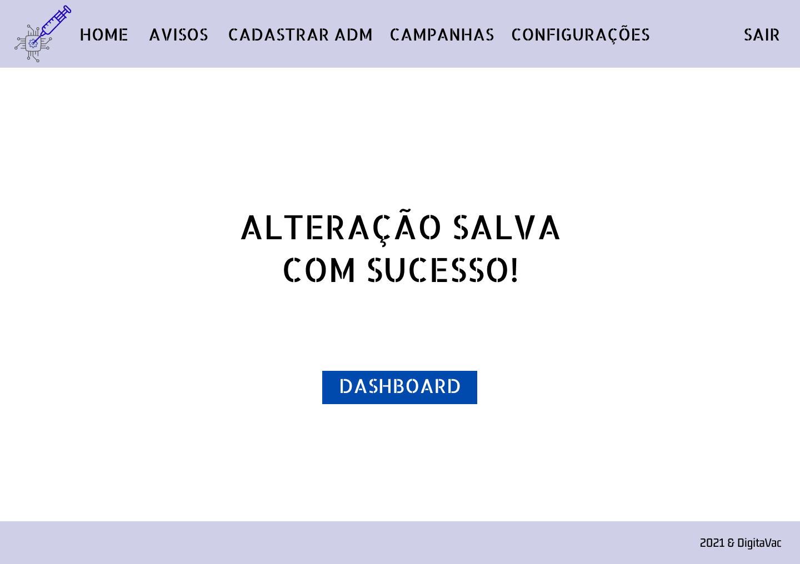

# Projeto de Interface

Pré-requisitos: <a href="2-Especificação.md"> Documentação de Especificação</a>

> As interfaces do sistema foram pensadas para atenderem de forma simples e intuitiva todas as nossas personas. 

> Sendo assim, o sistema possui botões simples e redirecionamentos básicos entre as páginas, visando um melhor aproveitamento por parte do usuário leigo e do usuário habilidoso, mas sem tempo. 

> Os requisitos do sistema contam connotificações que serão enviadas via email e sistema. São demonstradas abaixo apenas as notificações do sistema visto que as de email variam de acordo com a caixa de entrada do usuário. 

> O projeto de interface abaixo atende todos os requisitos funcionais listados [aqui](https://github.com/ICEI-PUC-Minas-PPLES-TI/PLF-ES-2021-2-TI1-7946100-projeto-saude/blob/master/Documentacao/2-Especificação.md).

## User Flow

## Wireframes de Usuário

> Aqui o usuário tem o primeiro contato com o sistema. A tela de apresentação, sem login.

> Tela de cadastro

> Tela de login

> Dashboard -> depois de logado

> Calendário para acompanhar as vacinas que deve tomar

> Histórico de vacinas do paciente

> Cadastro de um novo registro no histórico

> Alteração de um registro já inserido

> Tela de informações do usuário

> Tela de configurações do usuário

> Tela de ajuda, onde o usuário pode solicitar suporte

## Wireframes de ADM do sistema

> Aqui o ADM tem o primeiro contato com o sistema. A tela de apresentação, sem login.

> Tela de login do usuário tipo ADM

> Dashboard -> depois de logado

> O usuário ADM pode cadastrar novos avisos

> O usuário ADM pode cadastrar outros ADMs

> O usuário ADM pode cadastrar novas campanhas de vacinação

> É possível alterar suas configurações de login ADM no próprio login

> A cada alteração feita pelo ADM ele será direcionado para a tela de confirmação da alteração

> O protótipo interativo do projeto (tanto login de usuário quanto de ADM) pode ser acessado [aqui](https://www.figma.com/proto/cXcXpCFuI0zA7V5Eev4g8R/Tela-inicial?node-id=1%3A3&scaling=min-zoom&page-id=0%3A1&starting-point-node-id=1%3A3)
