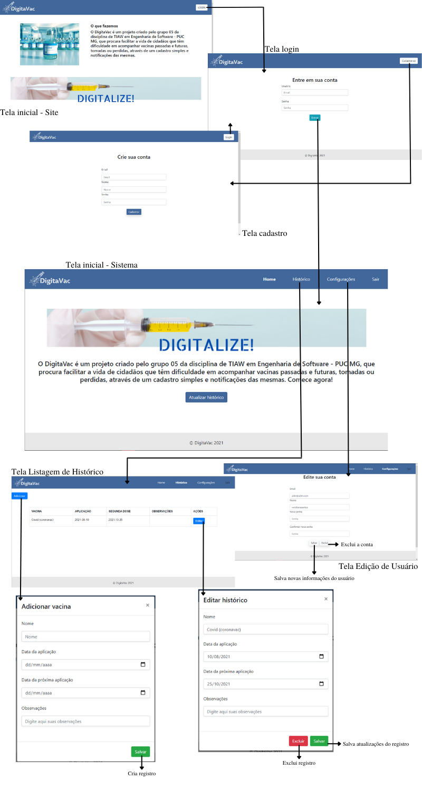

# Projeto de Interface

Pré-requisitos: <a href="2-Especificação.md"> Documentação de Especificação</a>

> As interfaces do sistema foram pensadas para atenderem de forma simples e intuitiva todas as nossas personas. 

> Sendo assim, o sistema possui botões simples e redirecionamentos básicos entre as páginas, visando um melhor aproveitamento por parte do usuário leigo e do usuário habilidoso, mas sem tempo. 

> O projeto de interface abaixo atende todos os requisitos funcionais listados [aqui](https://github.com/ICEI-PUC-Minas-PPLES-TI/PLF-ES-2021-2-TI1-7946100-projeto-saude/blob/master/Documentacao/2-Especificação.md).

## User Flow

