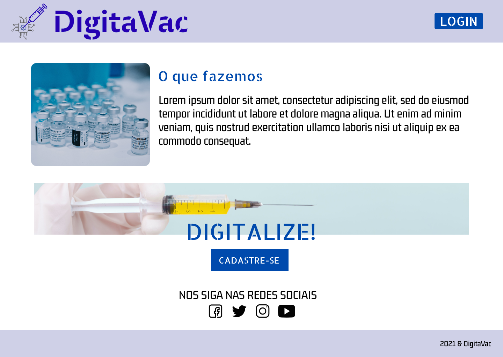
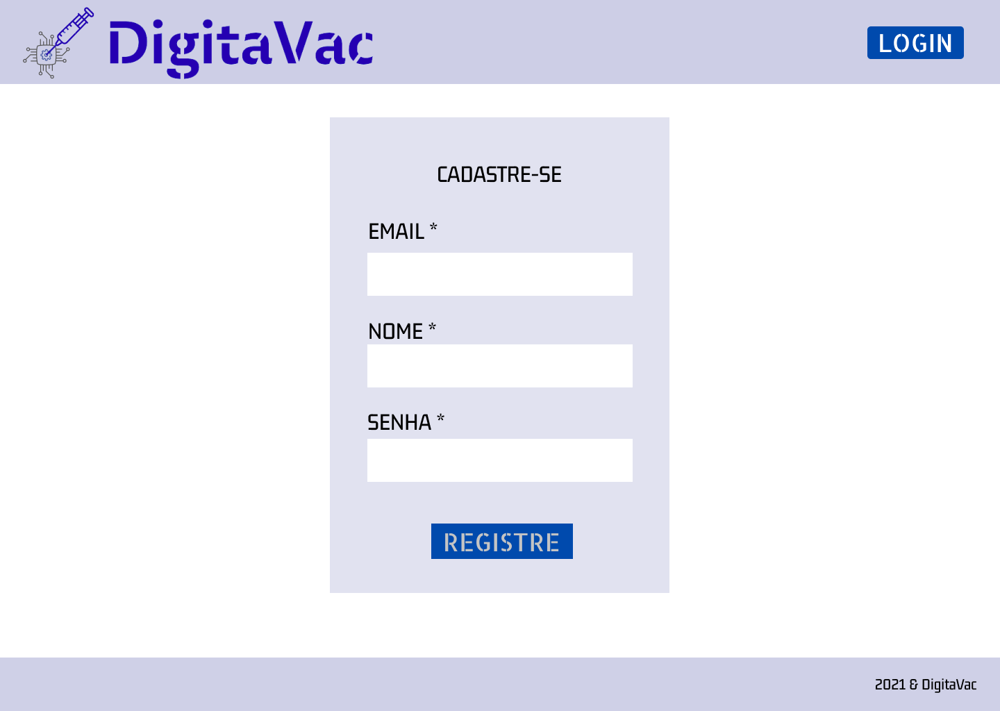
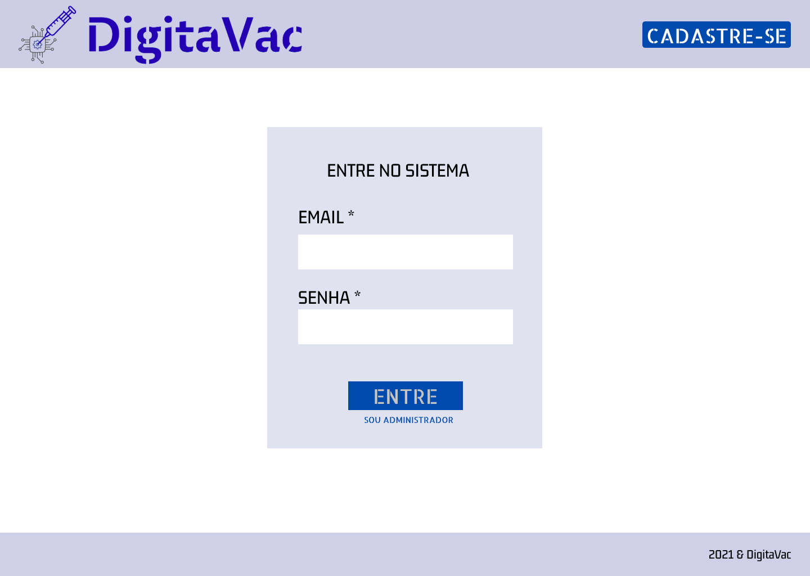
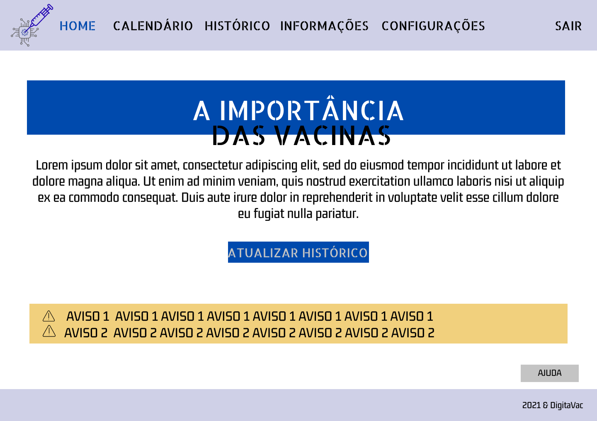
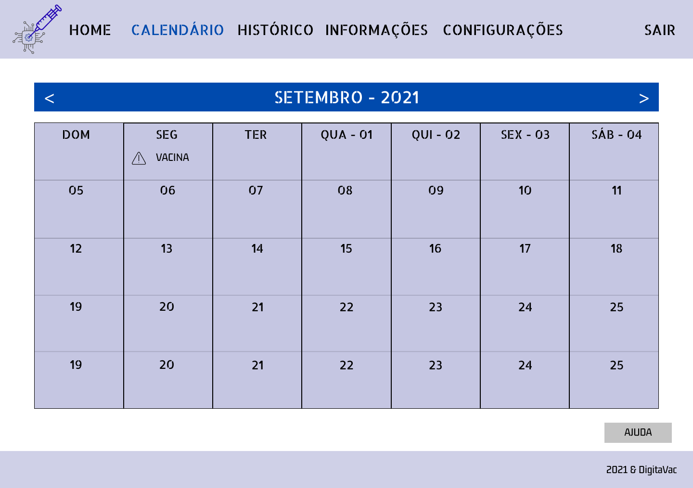
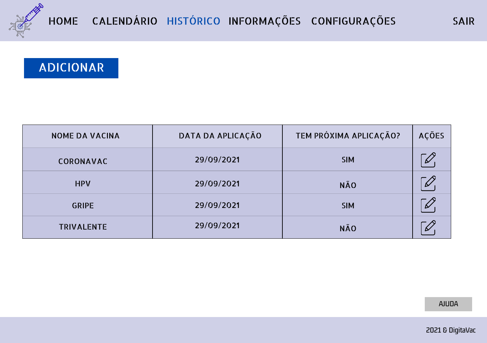
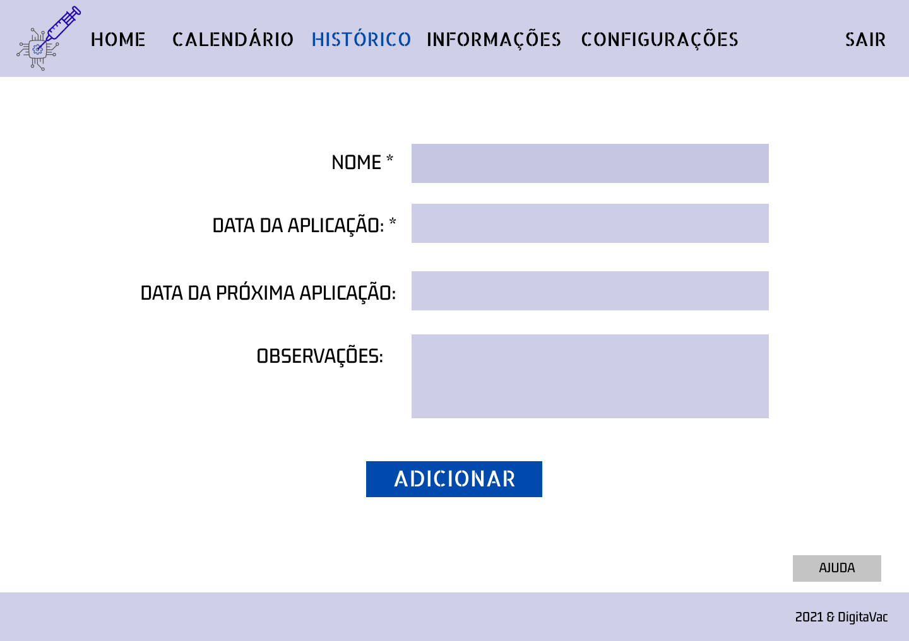
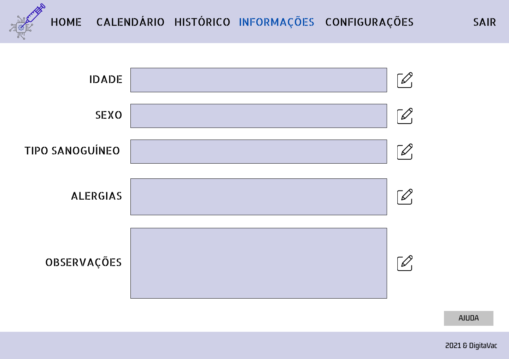
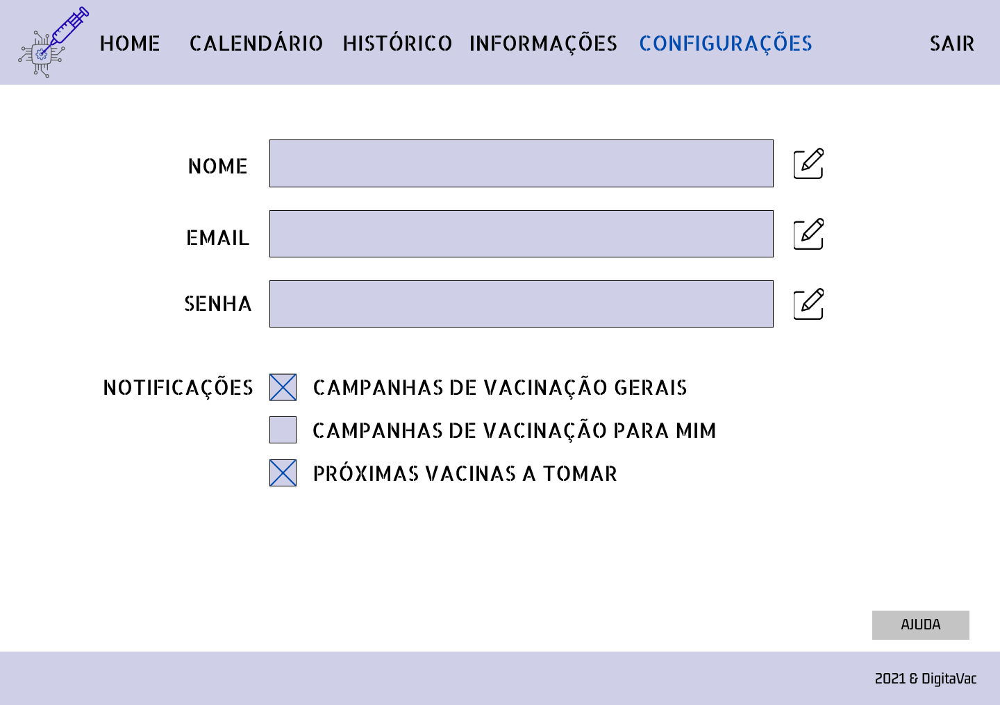
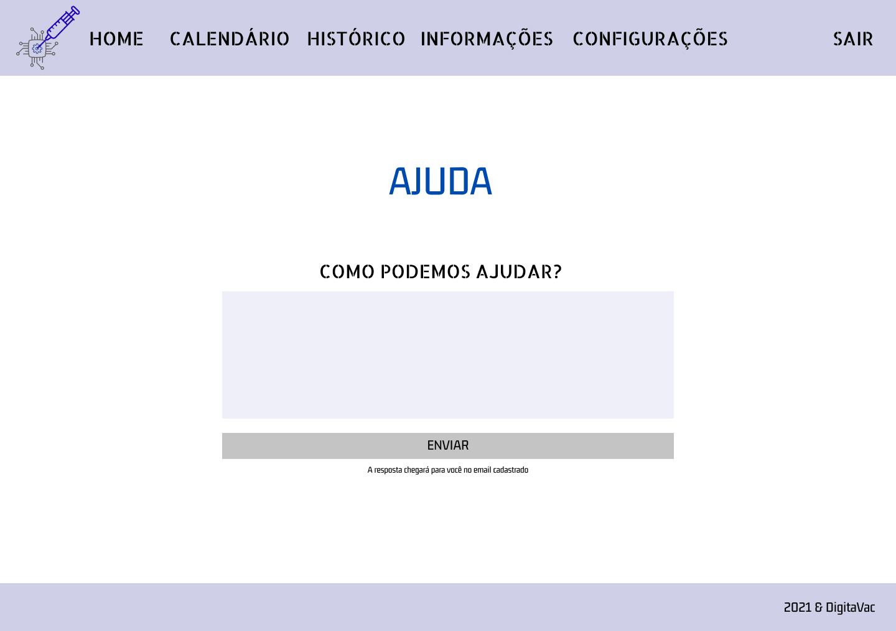

# Projeto de Interface

Pré-requisitos: <a href="2-Especificação.md"> Documentação de Especificação</a>

> Apresente as principais a interface da plataforma. Discuta como ela
> foi elaborada de forma a atender os requisitos funcionais, não
> funcionais e histórias de usuário abordados nas [Especificações do
> Projeto](2-Especificação.md).

## User Flow

## Wireframes de Usuário

> Aqui o usuário tem o primeiro contato com o sistema. A tela de apresentação, sem login.

> Tela de cadastro

> Tela de login

> Dashboard -> depois de logado

> Calendário para acompanhar as vacinas que deve tomar

> Histórico de vacinas do paciente

> Cadastro de um novo registro no histórico

> Alteração de um registro já inserido

> Tela de informações do usuário

> Tela de configurações do usuário

> Tela de ajuda, onde o usuário pode solicitar suporte

> O protótipo interativo do projeto pode ser acessado [aqui](https://www.figma.com/proto/cXcXpCFuI0zA7V5Eev4g8R/Tela-inicial?node-id=1%3A3&scaling=min-zoom&page-id=0%3A1&starting-point-node-id=1%3A3)
