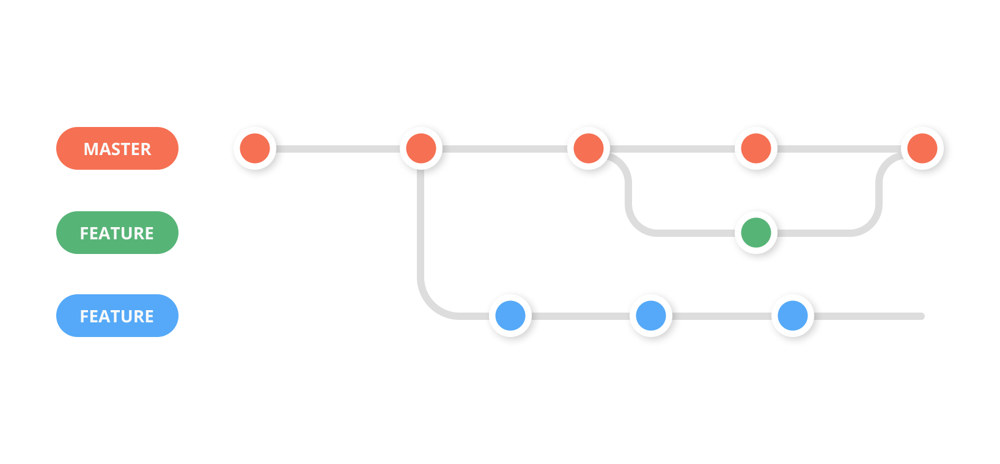

# Gestão de Configuração

> Para o processo de gestão do código fonte foi utilizado o processo de Git Feature Branch Workflow, processo de fluxo de trabalho onde os desenvolvedores trabalharam na mesma base de código porem em ramificações distintas do mesmo. Sendo assim cada desenvolvedor foi responssável por um artefato e ao concluir recurso este foi adicionado ao código principal sem que haja dependência de artefatos distintos que ainda estão em desenvolvimento.

## Controle de Versão

A ferramenta de controle de versão adotada no projeto foi o
[Git](https://git-scm.com/), sendo que o [Github](https://github.com)
foi utilizado para hospedagem do repositório `upstream`.

O projeto segue a seguinte convenção para o nome de branchs:

- `master`: versão estável já testada do software
- `unstable`: versão já testada do software, porém instável
- `testing`: versão em testes do software
- `dev`: versão de desenvolvimento do software

Quanto à gerência de issues, o projeto adota a seguinte convenção para
etiquetas:

- `bugfix`: uma funcionalidade encontra-se com problemas
- `enhancement`: uma funcionalidade precisa ser melhorada
- `feature`: uma nova funcionalidade precisa ser introduzida

## Hospedagem

> Foram utilizados o Repl.it e GithubPage como ambientes de hospedagem do site do projeto.
Segue os URLs do ambiente onde o site é mantido.
>
> 17 Repl.it: https://digitavac.veridianathayna.repl.co/
>
> A publicação no site do Repl.it foi feita por meio do import dos arquivos do repositório do GitHub ao criar um novo Repl no site de hospedagem.
> https://replit.com/
