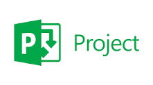

# Gerenciamento de Projeto

> Para o desenvolvimento do projeto a equipe está utlizando metodologia ágil Scrum. 
> Aplicando inspeções periódicas a partir dos sprints reviews; e adaptando o projeto de acordo com as necessidades e modificações dos requisitos. 

## Divisão de Papéis

> <strong>Product Owner:</strong> Veridiana Santos  
> <strong> Scrum Master:</strong> Matheus Andrade  
> <strong>Dev Team:</strong> 
> > * Fabio Silva
> > * Giovane Diniz
> > * Matheus Silva
> > * Thiago Mota

## Processo

> Coloque  informações sobre detalhes da implementação do Scrum seguido
> pelo grupo. O grupo poderá fazer uso de ferramentas on-line para acompanhar
> o andamento do projeto, a execução das tarefas e o status de desenvolvimento
> da solução.
> 
> **Links Úteis**:
> - [Tutorial Trello](https://trello.com/b/8AygzjUA/tutorial-trello)
> - [Gestão ágil de projetos com o Trello](https://www.youtube.com/watch?v=1o9BOMAKBRE)
> - [Gerência de projetos - Trello com Scrum](https://www.youtube.com/watch?v=DHLA8X_ujwo)
> - [Tutorial Slack](https://slack.com/intl/en-br/)

## Ferramentas

As ferramentas empregadas no projeto são:

- Editor de código.
- Ferramentas de comunicação
- Ferramentas de diagramação

O editor de código foi escolhido porque ele possui uma integração com o
sistema de versão. As ferramentas de comunicação utilizadas possuem
integração semelhante e por isso foram selecionadas. Por fim, para criar
diagramas utilizamos essa ferramenta por melhor captar as
necessidades da nossa solução.

> Liste quais ferramentas foram empregadas no desenvolvimento do
> projeto, justificando a escolha delas, sempre que possível.
> 
> **Possíveis Ferramentas que auxiliarão no gerenciamento**: 
> - 
> - 
> 
> - 
> - 
