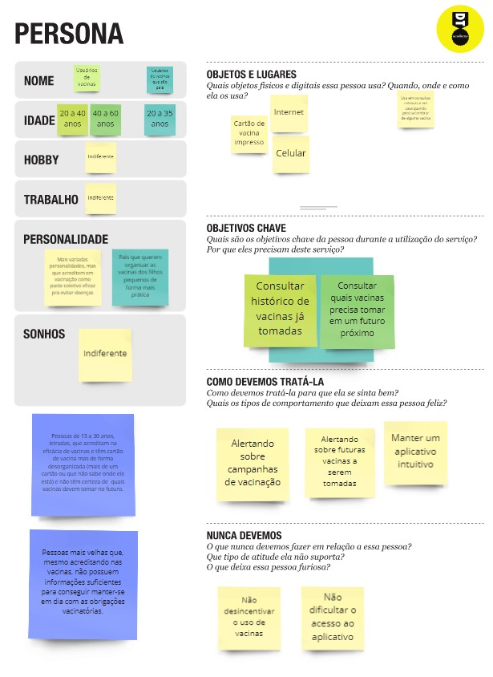
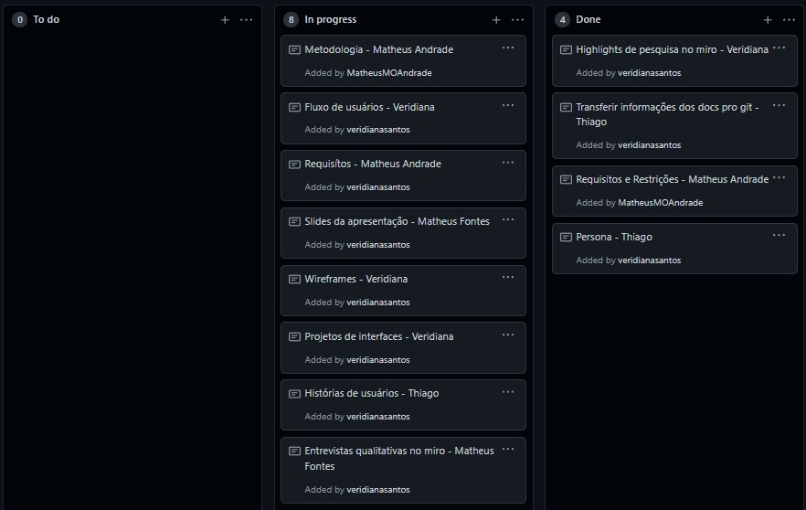

# Gerenciamento de Projeto

> Para o desenvolvimento do projeto a equipe está utlizando metodologia ágil Scrum. 
> Aplicando inspeções periódicas a partir dos sprints reviews semanais; e adaptando o projeto de acordo com as necessidades e modificações dos requisitos. 

## Divisão de Papéis

> <strong>Product Owner:</strong> Veridiana Santos  
> <strong> Scrum Master:</strong> Matheus Andrade  
> <strong>Dev Team:</strong> 
> > * Fabio Silva
> > * Giovane Diniz
> > * Matheus Silva
> > * Thiago Mota

## Processo

> A equipe atua em sprints semanais para as incrementações do produto. 
> Semanalmente são feitas reuniões que abordam as atividades de Sprint Planning, Sprint Review e Sprint Retrospective; respectivamente definindo o backlog da próxima sprint, necessidades de adaptação do produto e do processo.   
> 
> A equipe está utilizando o Miro e um Kanban Board no GitHub para o gerenciamento das tarefas.
> O [Miro](https://miro.com/app/board/o9J_lxqL3Ls=/) vem sendo utilizado como plataforma de colaboração. Uma ferramenta de brainstorm que vem possibilitando a aglutinação das ideias dos componentes de maneira democrática por meio de Post-its, durante as reuniões e Daily Scrums. Além disso o Miro é a principal ferramenta para a construção da Persona, concepção do usuário final e das características do produto nas atividades dos sprints.
> 

 <strong>Imagem:</strong> Construção da persona no Miro utilizando Post-it.
> 
> O [Kanban Board](https://github.com/ICEI-PUC-Minas-PPLES-TI/PLF-ES-2021-2-TI1-7946100-projeto-saude/projects/1) criado no GitHub, vem sendo utilizado para a designação das tarefas. O mesmo também executa o papel de Backlog de cada sprint semanal.
> 

> 
> ### Estrutura do Kanban Board:
> * <strong>To do:</strong> Tarefas a serem executadas definidas no Sprint Planing, representam o Backlog do próximo sprint.
> * <strong>In progress:</strong> Tarefas que estão sendo executadas.
> * <strong>Done:</strong> Tarefas concluidas, serão debatidas no próximo Sprint Review e Sprint Retrospective.
>  

## Ferramentas

> A tabela a seguir apresenta as ferramentas empregadas no projeto.

| Ambiente | Plataforma | Link de acesso |
|----------|------------|----------------|
| Repositório de código fonte, documentação do projeto. | GitHub | https://github.com/ICEI-PUC-Minas-PPLES-TI/PLF-ES-2021-2-TI1-7946100-projeto-saude |
| Kanban Board - Gerenciamento e designação das tarefas. | GitHub | https://github.com/ICEI-PUC-Minas-PPLES-TI/PLF-ES-2021-2-TI1-7946100-projeto-saude/projects/1 |
| Documentos do projeto - Backup| Google Drive | https://drive.google.com/drive/folders/1Gb_w65RXXSZdNdquSArGnOJSCtdtZsnp |
| Plataforma de colaboração | Miro | https://miro.com/app/board/o9J_lxqL3Ls=/ |
| Prototipação de Interface e Wireframes | Figma | https://www.figma.com/ |

