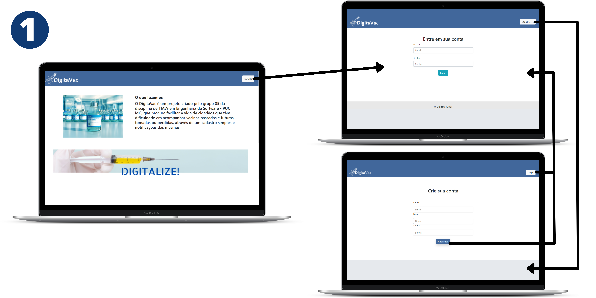
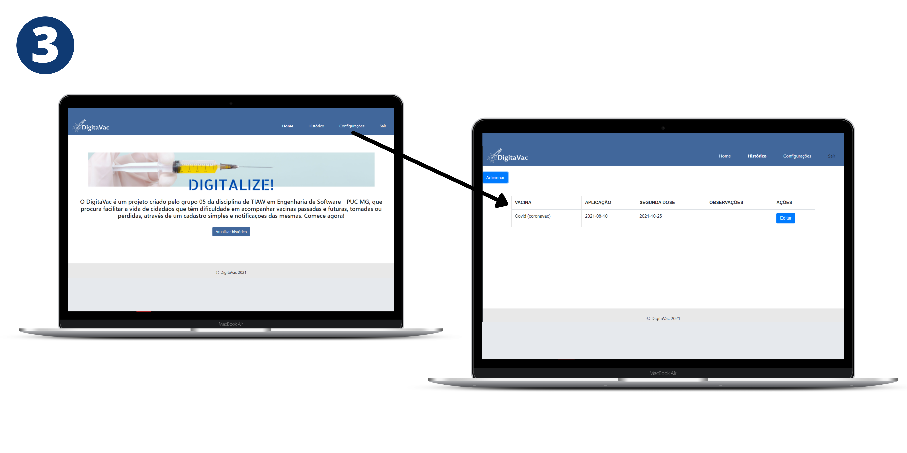
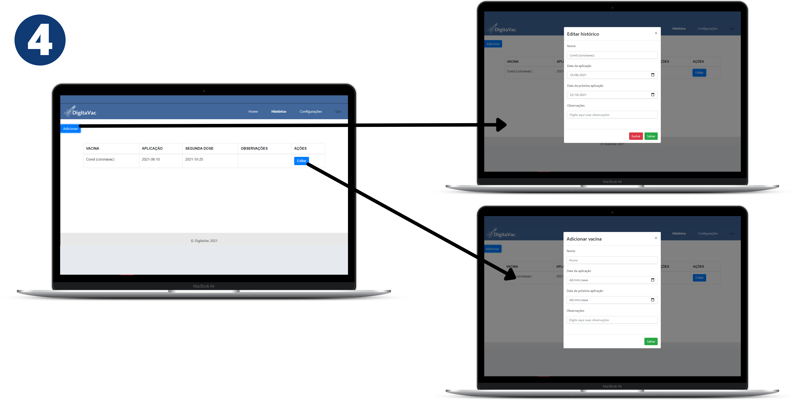
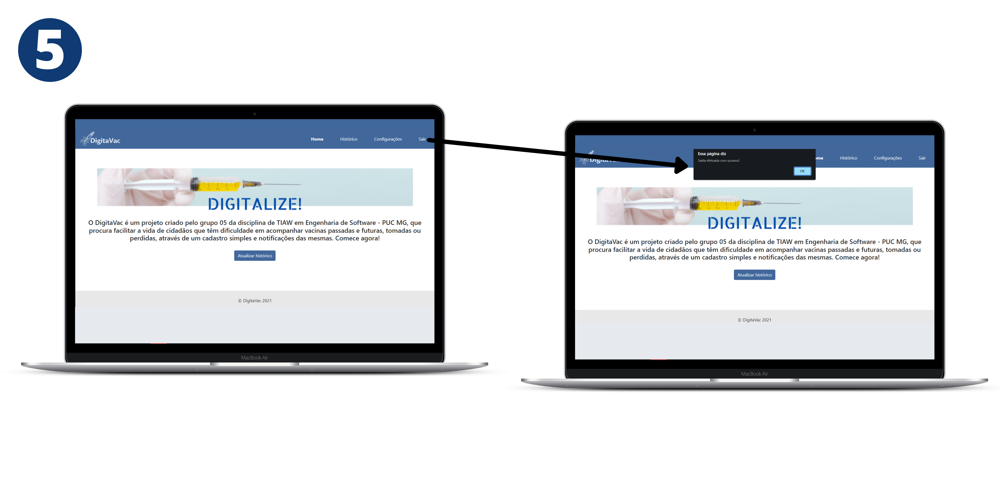

# Projeto da Solução

Pré-requisitos: <a href="4-Gestão-Configuração.md"> Ambiente e Ferramentas de Trabalho</a>

## Tecnologias Utilizadas

* Ferramentas de organização
> Miro
> 
> Figma
> 
> kanban
* IDEs
> Visual Studio Code
> 
> Sublime Text
* Ferramentas de teste
> Ferramenta de desenvolvedor do Chrome (para verificação de erros)
* Ferramentas de controle de versão
> GitHub
* Linguagens
>HTML 5
>
>CSS 3
>
>JavaScript

## Arquitetura da solução

A imagem a seguir demostra o fluxo que o usuário percorre no uso da nossa solução. 

Depois de acessar o site, o usuário efetua o seu cadastro e posteriormente o login, entrando na home do sistema. (1)

Caso ele precise editar os dados que cadastrou, pode ir à tela de configurações e realizar todas as alterações necessárias, ou excluir a conta. (2)

Caso prefira acompanhar suas vacinas ele vai à tela de histórico usando o menu ou o botão da tela inicial do sistema. (3)

Na listagem ele pode visualizar tudo que foi cadastrado por ele anteriormente e pode escolher editar um registro alterando qualquer dado dele ou mesmo excluindo da listagem, ou ainda pode adicionar uma nova vacina recebida informando os dados básicos da mesma. (4)

Ele pode sair do sistema clicando no menu Sair. (5)

