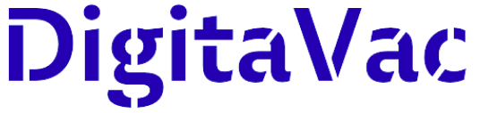
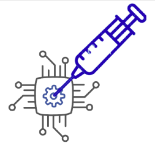

# Apresentação

Pré-requisitos: Todos os demais artefatos

> Clique [aqui](https://docs.google.com/presentation/d/1oL8HW-LMLdUzidLYq7FdEhyTFvYlu1hHm5RKaGcEb20/edit?usp=sharing) para visualizar o aquivo da apresentação de slides do projeto, usada na entrega de 15/12/2021.

## Título do Projeto
> DigitaVac

## Identidade Visual (Marca, Design)
> Logo: 
> 

> Ícone:
> 

> Cores bases: AZUL: #004AAD // CINZA 01: #C3C4E1 // CINZA 02: #545454

## Conjunto de Slides (Estrutura)
> [Link para acesso aos slides da apresentação no GitHub](https://github.com/ICEI-PUC-Minas-PPLES-TI/PLF-ES-2021-2-TI1-7946100-projeto-saude/blob/master/Divulgacao/Apresentacao/Apresentação_final.pdf)
>
> Serão apresentados os seguintes tópicos:
> - O problema 
> - O objetivo do projeto como solução
> - Metodologia
> - Equipe
> - Status atual
> - Projeções futuras 

